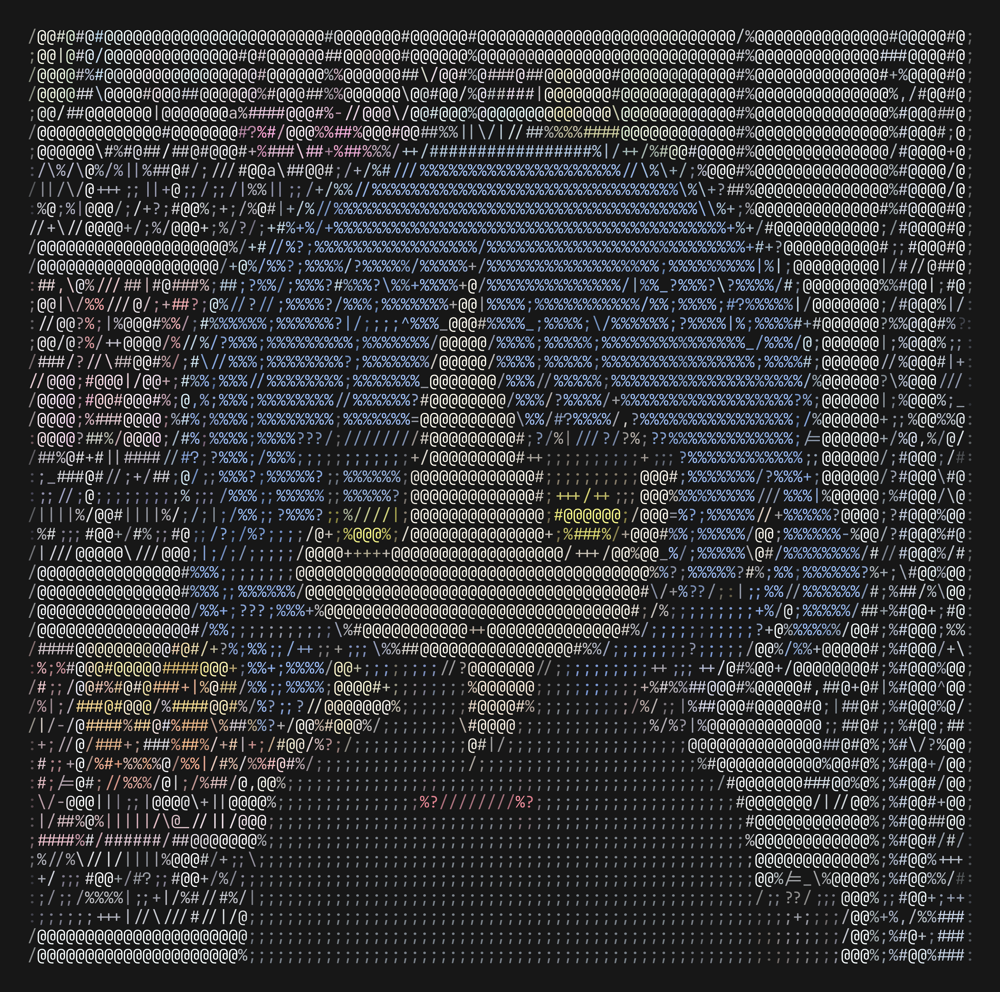
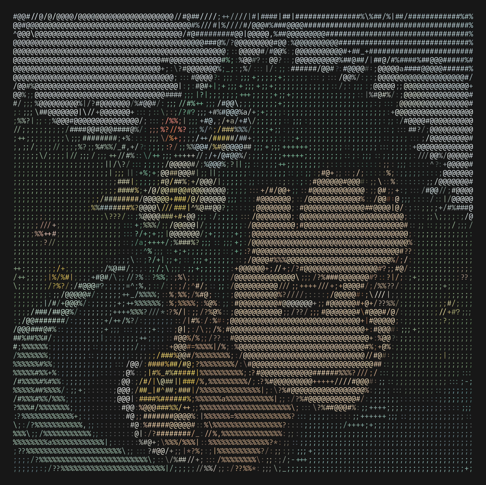
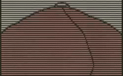

# Terminal ASCII image/video renderer

A terminal media player that converts video and images into real-time,
full-color ASCII art. It leverages **libmpv** for decoding and edge-detection
filtering, matching $5 \times 10$ pixel patches to character bitmasks via
Hamming distance inside a TUI.

## Showcase

<table>
  <tr>
    <td></td>
    <td></td>
    <td></td>
  </tr>
  <tr>
    <td></td>
    <td></td>
    <td></td>
  </tr>
</table>

## Try out

**Using Nix:**

```bash
nix shell github:Nadim147c/ascii
```

**Go Get:** Requires `libmpv` dev headers, and `CGO_ENABLED=1`.

```bash
go install github.com/Nadim147c/ascii@latest
```

**Usage**:

```bash
ascii-player [flags] <file>
```

- **Flags:**
  - `-brightness 0.3`: adjust frame brightness
  - `-image output.txt`: render image to text file
  - `-debug log.txt`: enable logging.
- **Controls:** `Space` Play/Pause, `→/←` Seek 5s, `q` Quit.

## License

[GPL-v3](./LICENSE)
